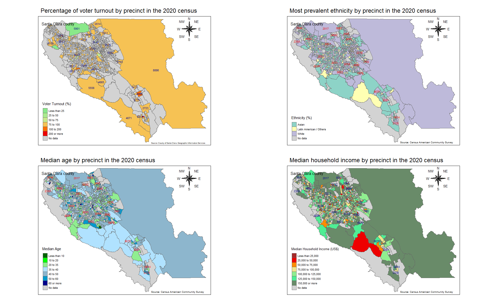

**Introduction**

Spatial analysis of the voting behavior, demographics, income, and ethnicity of the precincts in the 18th congregational district from Santa Clara County in California, US, in the 2020 general election. The findings will be presented through graphs, descriptive statistics, maps, and comments.


**Part 1 - Voter Turnout in the Santa Clara County**

I am using the spreadsheet with the election results by precinct of Santa Clara County to get a better overview of how the voter turnout behaved in the 18th Congressional District.

Installing and loading the packages/libraries that will be used in this project:

```{r results='hide', message=FALSE, warning=FALSE}

pacotes <- c("tidyverse","ggplot2","dplyr","tibble","stringr",
             "tidyr", "readxl", "tmap", "rgdal", "maptools")

if(sum(as.numeric(!pacotes %in% installed.packages())) != 0){
  instalador <- pacotes[!pacotes %in% installed.packages()]
  for(i in 1:length(instalador)) {
    install.packages(instalador, dependencies = T)
    break()}
  sapply(pacotes, require, character = T) 
} else {
  sapply(pacotes, require, character = T) 
}

```

Loading the databases I will be working with:

```{r}

#18th district votes

ConDis18 <- read_xlsx("18.xlsx", col_names = TRUE)

#Registered Voters

register_votes <- read_xlsx("Registered Voters.xlsx", col_names = TRUE)


```

Taking a look at the data below we can see some of the columns that are *numeric* are categorized as *character*, having that in mind I need to turn them into *numeric*.

```{r}
str(ConDis18)

str(register_votes)
```

Converting the columns types:

```{r}

class(ConDis18$`Election_Day(Anna)`) <- "numeric"
class(ConDis18$`Vote_By_Mail(Anna)`) <- "numeric"
class(ConDis18$`Election_Day(Rishi)`) <- "numeric"
class(ConDis18$`Vote_By_Mail(Rishi)`) <- "numeric"
class(register_votes$Voter_Turnout) <- "numeric"

```

Merging both tables into a new one to get a better insight into voter turnouts in every single precinct for the 18th Congressional District.

```{r}

df <- left_join(x = ConDis18,
                y = register_votes,
                by = "County")

#Selecting the relevant columns and rows I want from the new data frame.

df <- df[-205 ,c(1:9, 12)]


#Rounding the values from the Voter_Turnout Column as it will make the job easier:

df <- df %>% 
  mutate(Voter_Turnout = round(df$Voter_Turnout))

#Removing the four zeros at the beginning of the precinct
#codes to get better visualizations in the graph

df_complete <- df
df_complete$County <- substr(df_complete$County, 4, 7)

```

Some descriptive statistics about voters who turnout in the 18th Congressional District in the 2020 elections:

```{r}

summary(df_complete$Voter_Turnout)

```
As we can see the median and mean are very similar even existing some outliers in the data set as we can see in the maximum value. The percentage of people who voted in every precinct was very satisfactory as the mean and median were around *89%.*

Plotting the findings in a scatter plot to visualize spatially the precincts according to their respective voter turnouts:

```{r results='hide', message=FALSE, warning=FALSE, fig.width=6,fig.height=6}

ggplot(df_complete, aes(x = Total, y = Voter_Turnout)) +
  geom_point(color = "blue") +
  geom_text(label = df_complete$County, size = 2.5, vjust = -1) +
   scale_y_continuous(breaks = seq(0,950, by = 100),
                     labels = paste0(seq(0,950, by = 100 ), "%")) +
  labs(title = "Number of votes and voters turnout by precinct",
       subtitle = "18th congressional district",
       x = "Number of votes",
       y = "Voter turnout",
       caption = "Source: Scytl") +
  theme_classic()
  
```

Lots of precincts overlap each other in the 85-100% range in the Y-axis because the mean and median, as seen before, are around 89% but we can identify some possible outliers in the data set such as the precinct 2001 that presented a surprisingly 900% voter turnout because there were more people voting than the registered voters, and the precinct 2305 had almost 4.000 votes that were way higher than the other ones. Thinking about that, I will slice the data to get cleaner visualization.

Getting the top 10 highest voters turnout from the data set:

```{r results='hide', message=FALSE, warning=FALSE, fig.width=6,fig.height=6}

df_top10 <- df_complete %>% slice_max(n = 10, order_by = Voter_Turnout)

  ggplot(df_top10, aes(x = Total, y = Voter_Turnout)) +
  geom_point(color = "blue") +
  geom_text(label = df_top10$County, size = 2.5, vjust = -1) +
   scale_y_continuous(breaks = seq(0,950, by = 100),
                     labels = paste0(seq(0,950, by = 100 ), "%")) +
  labs(title = "Top 10 highest percentages of voters turnout by precinct",
       subtitle = "18th congressional district",
       x = "Number of votes",
       y = "Voter turnout",
       caption = "Source: Scytl") +
  theme_classic()
```

Now we can see more clearly the data points and which ones presented the highest voter turnouts in the 18th Congressional District. All of them had just a few voters and that's probably the main explanation for such high percentages.

I will merge the previous data frame with another one containing data from the census block group to plot the findings into a map. That's crucial to analyze if there is a spatial correlation in the data and it is very used in politics to find where the potential voters are located. 

```{r}

#loading the census block group file that I previously cleaned and organized in Excel

cb <- read_xlsx("santa_clara_pct_cbg_mappings.xlsx", col_names = T)

#Converting the census block group columns from "numeric" to "character"

class(cb$County) = "character"
class(cb$BG) = "character"

#Merging the data

df_cb <- left_join(x = df_complete,
                   y = cb,
                   by = "County")

#selecting the useful columns

df_cb <- df_cb[ ,c(1, 10:11)]


```

Loading the shapefile of the census block group from Santa Clara County in California:

```{r results='hide', message=FALSE, warning=FALSE}

shp_df <- readOGR(dsn = "ShapeFile",
                     layer = "BlockGroup2010")
```
Quick view of the shapefile:

```{r}
plot(shp_df)
```


Quick view of some data from the shapefile:

```{r}

#removing the 0 from the beginning of the block group column to merge the data properly

shp_df$blockgroup <- substr(shp_df$blockgroup, 2, 12)

#Visualizing the first rows

head(shp_df@data) %>% 
  dplyr::select( ,c(1:6)) %>% 
  knitr::kable()
```

The demographic data above is out of date because it is from the 2010 census and for this reason I will only use the shape formats of the census block groups to plot the voter turnout data into a map for now. Later in this project, I will get updated demographic data from the American census website for further and deeper analysis.

Merging the shapefile with the data frame containing the voter turnout:

```{r}

#Merging

shp_df@data <- left_join(x =shp_df@data,
                         y = df_cb,
                         by = c("blockgroup" = "BG"))
                        

#Removing the duplicate values that came from the excel file downloaded from the internet

shp_df@data <- unique(shp_df@data)

#Slicing unuseful rows to be able to plot the data into a map

shp_df@data <- shp_df@data[-c(1:60), ]


```

Plotting the data into a map to get a better idea of how the percentage of voters behaved in Santa Clara County in the 2020 elections.

```{r results='hide', message=FALSE, warning=FALSE, fig.width=8,fig.height=8}


tm_shape(shp = shp_df) +
  tm_polygons("Voter_Turnout",
              title = "Voter Turnout (%)",
              style = "fixed",
              palette = c("darkgreen", "lightgreen", "khaki", "darkorange", "red2"),
              breaks = c(-Inf,25,50,75,100,200, Inf),
              colorNA = "lightgray",
              textNA = "No data") +
   tm_text("County", size = 0.7,
           remove.overlap = TRUE,
           col = "darkblue") +
  tm_layout(main.title = "Percentage of voter turnout by precinct in the 2020 census",
            title = "Santa Clara county",
            title.size = 0.7,
            legend.position = c("left", "bottom"),
            main.title.size = 1.5) +
   tm_compass(type = "8star",
             show.labels = 3,
             size = 3,
             position = c(0.89, 0.85)) +
  tm_credits("Source: County of Santa Clara. Geographic Information Services",
             position = c(0.65, 0),
             size = 0.5)


```
*The blue numbers on the map refer to the precinct codes from the 2020 general election. It is important to mention the codes can vary within a census block group as some precincts have more than one census block group, or even share them with other precincts*

We can get some interesting insights with the map above:

- The southern zone of Santa Clara county presented a higher percentage of voter turnout by precinct in the 18th Congressional District.
- The northern zone of Santa Clara county presented a lower percentage of voter turnout by precinct in the 18th Congressional District.

**Part 2 - Demographic and Socio-Economic Overview of the 18th Congregational District**

As I mentioned before, I will use updated data from the 2020 census to conduct my analysis in this part because the data contained in the shapefile refer to the 2010 census.

I will load the following datasets from the 2020 census that I previously cleaned and tidied in the excel:

- Median age by sex;
- Median household income;
- Ethnicity.

```{r}

age <- read_xlsx("median_age_by_sex.xlsx", col_names = T)

income <- read_xlsx("median_household_income.xlsx", col_names = T)

race <- read_xlsx("race_over18_years.xlsx", col_names = T)


```

Before merging the datasets, I need to tidy the race dataset because it needs to have a percentage of each ethnicity in each census block group.

```{r}

#Getting the percentage for each ethnicity

race$white_pct <-  round((race$white*100)/race$race_total, 2)
race$black_pct <-  round((race$black*100)/race$race_total, 2)
race$native_pct <-  round((race$native_people*100)/race$race_total, 2)
race$asian_pct <-  round((race$asian*100)/race$race_total, 2)
race$pacific_pct <-  round((race$pacific_islander*100)/race$race_total, 2)
race$other_pct <-  round((race$other_races*100)/race$race_total, 2)
race$mixed_pct <-  round((race$mixed_people*100)/race$race_total, 2)

#Finding the highest percentage per census block group and 
#assigning the name of the respective race

race$max_pct <- apply(race[ ,10:16], 1, max)

race$ethnicity[race$max_pct == race$white_pct] <- "White"
race$ethnicity[race$max_pct == race$black_pct] <- "Black"
race$ethnicity[race$max_pct == race$native_pct] <- "Native American"
race$ethnicity[race$max_pct == race$asian_pct] <- "Asian"
race$ethnicity[race$max_pct == race$pacific_pct] <- "Pacific Islander"
race$ethnicity[race$max_pct == race$other_pct] <- "Latin American / Others"
race$ethnicity[race$max_pct == race$mixed_pct] <- "Mixed-race"
```


Merging all these datasets into one:

```{r}

#Merging

df_pt2 <- left_join(x = age,
                    y = race,
                    by = "BG")

df_pt2 <- left_join(x = df_pt2,
                    y = income,
                    by = "BG")

#Matching the code of the census block group to the one in the 
#shapefile because this one is too large. In the dataset, 
#the code has more than 20 characters because it contains the complete 
#census group code but that's not necessary

df_pt2$BG <- substr(df_pt2$BG, 11, 22)

#Merging the dataset containing the precinct data per census block group

df_pt2 <- left_join(x = df_pt2,
                    y = cb,
                    by = "BG")

#Tidying the new dataset

df_pt2 <- df_pt2 %>% 
  dplyr::select(BG, everything())

#Fixing the variable type

class(df_pt2$total_median_age) <- "numeric"
class(df_pt2$male_median_age) <- "numeric"
class(df_pt2$female_median_age) <- "numeric"
```


Loading the shapefile in a new object

```{r results='hide', message=FALSE, warning=FALSE}

shp_df2 <- readOGR(dsn = "ShapeFile",
                     layer = "BlockGroup2010")

```

Merging the dataset to the shapefile

```{r}

#Removing one character from the census block group column to make 
#the merge with the precincts from the 18th congressional district

shp_df2@data$blockgroup <- substr(shp_df2@data$blockgroup, 2, 12)

#Merging

shp_df2@data <- merge(x = shp_df2@data,
                          y = df_pt2,
                          by.x = c("blockgroup"),
                          by.y =c("BG"))

#Selecting the useful and updated columns

shp_df2@data <- shp_df2@data[ ,-c(2:10, 13:16)]


#Removing the duplicate values that came from the excel file downloaded from the internet

shp_df2@data <-  distinct(shp_df2@data, blockgroup, .keep_all =  TRUE)

#Adding some NAs to the data frame from the shapefile to get the correct file size

shp_df2@data[932:1075, ] <- NA

```

Overview of the racial distribution among the precincts:

```{r results='hide', message=FALSE, warning=FALSE, fig.width=8,fig.height=8}

tm_shape(shp = shp_df2) +
  tm_polygons("ethnicity",
              title = "Ethnicity (%)",
              style = "fixed",
              colorNA = "lightgray",
              textNA = "No data") +
   tm_text("County", size = 0.7,
           remove.overlap = TRUE,
           col = "red2") +
  tm_layout(main.title = "Most prevalent ethnicity by precinct in the 2020 census",
            title = "Santa Clara county",
            title.size = 0.7,
            legend.position = c("left", "bottom"),
            main.title.size = 1.5) +
   tm_compass(type = "8star",
             show.labels = 3,
             size = 3,
             position = c(0.89, 0.85)) +
  tm_credits("Source: Census American Community Survey",
             position = c(0.65, 0),
             size = 0.6)


         
```
*The red numbers on the map refer to the precinct codes from the 2020 general election. It is important to mention the codes can vary within a census block group as some precincts have more than one census block group, or even share them with other precincts*

We can get two good insights about the percentage of each race by precinct from the map above:

- Asians and Latin Americans/Others were concentrated on the west side of the 18th Congregational District.
- White people were more concentrated on the east side of the 18th Congregational District.

Overview of the median age by precinct:

```{r results='hide', message=FALSE, warning=FALSE, fig.width=8,fig.height=8}

tm_shape(shp = shp_df2) +
  tm_polygons("total_median_age",
              title = "Median Age",
              style = "fixed",
               palette = c("darkgreen","green", "lightgreen", "lightskyblue1",
                           "lightskyblue3", "deepskyblue3", "darkblue"),
              breaks = c(-Inf,10,20,35,40,50,60, Inf),
              colorNA = "lightgray",
              textNA = "No data") +
   tm_text("County", size = 0.7,
           remove.overlap = TRUE,
           col = "red") +
  tm_layout(main.title = "Median age by precinct in the 2020 census",
            title = "Santa Clara county",
            title.size = 0.7,
            legend.position = c("left", "bottom"),
            main.title.size = 1.5) +
   tm_compass(type = "8star",
             show.labels = 3,
             size = 3,
             position = c(0.89, 0.85)) +
  tm_credits("Source: Census American Community Survey",
             position = c(0.65, 0),
             size = 0.6)
```
*The red numbers on the map refer to the precinct codes from the 2020 general election. It is important to mention the codes can vary within a census block group as some precincts have more than one census block group, or even share them with other precincts*

Once more we have very interesting findings regarding the data spatial distribution:

- The precincts and census block groups with the prevalence of white people present an elevated median age.
- On the other hand, precincts and census block groups with Asians and Latin Americans/Others have a prevalence of younger people.

Overview of the household income by precinct:

```{r results='hide', message=FALSE, warning=FALSE, fig.width=8,fig.height=8}

tm_shape(shp = shp_df2) +
  tm_polygons("median_household_income",
              title = "Median Household Income (US$)",
              style = "fixed",
               palette = c("brown", "red2", "darkorange", "khaki",
                           "lightgreen", "seagreen2", "darkseagreen4"),
              breaks = c(-Inf,25000,50000,75000,100000,125000,150000, Inf),
              colorNA = "lightgray",
              textNA = "No data") +
   tm_text("County", size = 0.7,
           remove.overlap = TRUE,
           col = "darkblue") +
  tm_layout(main.title = "Median household income by precinct in the 2020 census",
            title = "Santa Clara county",
            title.size = 0.7,
            legend.position = c("left", "bottom"),
            main.title.size = 1.5) +
   tm_compass(type = "8star",
             show.labels = 3,
             size = 3,
             position = c(0.89, 0.85)) +
  tm_credits("Source: Census American Community Survey",
             position = c(0.65, 0),
             size = 0.6)

```
*The blue numbers on the map refer to the precinct codes from the 2020 general election. It is important to mention the codes can vary within a census block group as some precincts have more than one census block group, or even share them with other precincts*

Again there is a clear difference in household income according to the different precincts/census block groups and there is a clear correlation to the ethnicity map:

- Precincts with a higher prevalence of white people present a more elevated income;
- Precincts with a lower prevalence of white people present lower income.


I will conclude my analysis with the conclusion down below where I will briefly explain the most important points of my findings.

**Conclusion**

Plotting all maps side by side to get a better overview of the spatial correlations:

```{r pressure, echo=FALSE, fig.cap="Spatial Correlation", out.width = '100%'}




```

There is a clear correlation between age, ethnicity, and income when it comes to voter turnout because white people in their 40s and 50s who earn more than US$ 150.000 a year tend to have a lower inclination to attend the election day. Moreover, the highest voter turnouts come from the southeast side of the county where nonwhite people in their 30s with low/medium annual income live.

Although there is a correlation between the data variables we cannot say there is a causation between them as further analysis should be done to validate the correlation.